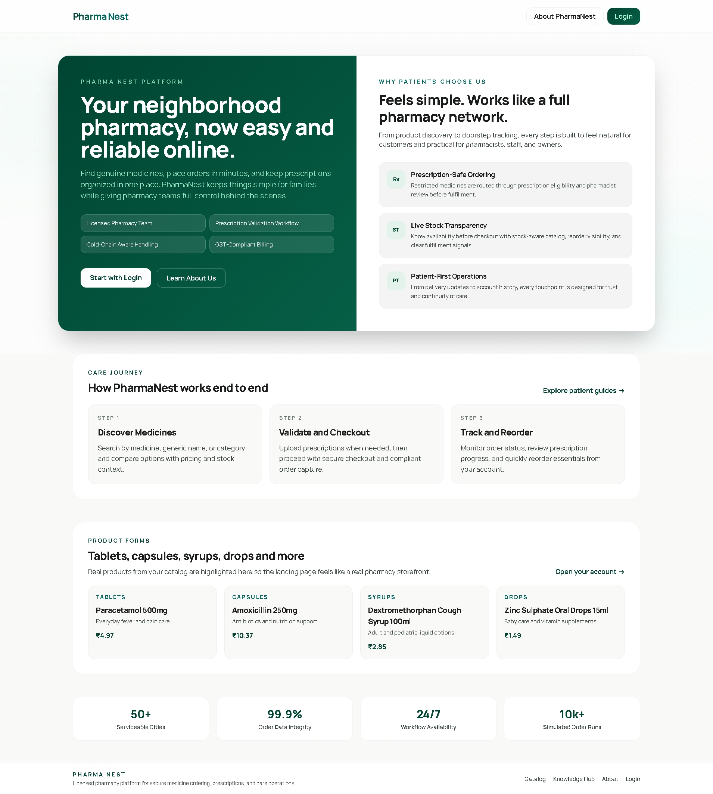
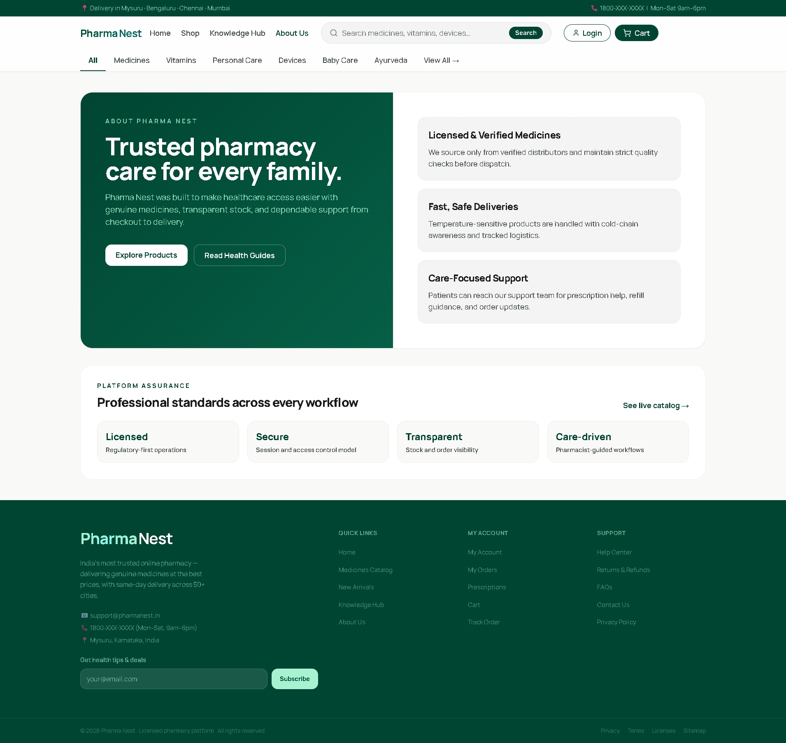

<div align="center">

# 💊 PharmaNest

### ✨ Modern Pharmacy Platform · Shop · Prescribe · Track · Operate

**A full-stack pharmacy web app for customers, pharmacists, staff, and admins.**

PharmaNest combines a polished storefront, prescription-aware workflows, secure authentication, and an operations dashboard in one connected system.

This README uses real product screenshots instead of a dedicated logo asset so the visuals match the current project files.

</div>

---

## 🌈 Why PharmaNest Exists

PharmaNest was created after the mini project [Pharmacy Supply Management System](https://github.com/AshishCherian15/Pharmacy-Supply-Management-System).
That earlier work inspired the bigger idea here: a cleaner experience, stronger role separation, richer product browsing, and a more complete deployment-ready pharmacy platform.

---

## 🎯 What PharmaNest Delivers

- Customer storefront with real medicine categories, product cards, and detail pages.
- Prescription-aware ordering flow with a clear status lifecycle.
- Secure login and registration with role-based protection.
- Dedicated modules for customer, staff/pharmacist, and admin workflows.
- Operations dashboard for inventory, orders, suppliers, sales, reports, users, and settings.
- API-first architecture with server routes for auth, customer flows, admin operations, and health checks.
- Deployment-ready structure for Vercel and PostgreSQL/Supabase.

---

## 🌟 Feature Summary

| Feature | Description |
| --- | --- |
| 🛍️ Customer Catalog | Browse medicines, product forms, and stock-aware listings |
| 🧾 Checkout Flow | Cart, order placement, and order history tracking |
| 📄 Prescription Flow | Upload/track prescription lifecycle with pharmacist/admin visibility |
| 🔐 Auth & Session | Secure cookie-based sessions with role-aware middleware guards |
| 🧑‍⚕️ Staff Console | Dashboard modules for inventory, sales, suppliers, prescriptions, and users |
| 📊 Reports | Aggregated operational insights for pharmacy management |
| 🩺 Health Endpoint | Deployment/runtime health check via API |
| 🚀 Deploy Ready | Vercel-friendly config + Supabase/PostgreSQL support |

---

## 🖼️ Visual Preview

<table>
	<tr>
		<td align="center"></td>
		<td align="center"></td>
	</tr>
	<tr>
		<td align="center"><strong>Landing Preview</strong></td>
		<td align="center"><strong>Customer Preview</strong></td>
	</tr>
</table>

---

## 📸 Screenshots From The Current Workspace

The `Screenshots/` folder contains the latest UI captures for the major customer, catalog, prescription, and operations flows. The gallery below uses representative images from that folder so the README stays readable while still showing the real product experience.

### Entry and onboarding

| Screenshot | What it shows |
| --- | --- |
|  | The public landing page with the main value proposition, trust cards, and footer navigation. |
|  | The split login entry screen for customers versus admin, staff, and pharmacists. |
|  | The customer sign-in form with demo access and secure account entry. |

### Customer experience

| Screenshot | What it shows |
| --- | --- |
|  | The customer dashboard with order status, prescription tracking, quick actions, and care guidance. |
|  | The shopping catalog with filters, stock-aware cards, prescription flags, and pagination. |
|  | The cart and order summary experience with quantity controls and checkout call-to-action. |
|  | The prescriptions page showing upload controls, verification status, and medicine lines. |

### Operations and management

| Screenshot | What it shows |
| --- | --- |
|  | The main admin dashboard with KPIs, sales charts, alerts, inventory snapshot, and supplier overview. |
|  | The inventory workspace with stock health cards, search and filters, medicine table, and edit/delete actions. |
|  | The add-medicine modal used to create or edit catalog items with image and expiry inputs. |
|  | The POS screen for staff to search products, build a sale, and complete checkout. |

### Extra captures in the folder

The folder also includes additional screenshots from the same flows, including alternate states and iterative UI snapshots. They are kept in `Screenshots/` for reference and change history, while the README focuses on the most important user journeys.

---

## 🛠️ Tech Stack

| Layer | Technology |
| --- | --- |
| Frontend | Next.js 15, React 19, Tailwind CSS |
| Language | TypeScript |
| Backend | Next.js App Router + Route Handlers |
| Database ORM | Prisma |
| Local DB | SQLite |
| Production DB | PostgreSQL (Supabase-ready) |
| Testing | Vitest |
| Tooling | ESLint, TypeScript, Prisma CLI, CI via GitHub Actions |

---

## 🏗️ Architecture Snapshot

```text
┌────────────────────────────────────┐
│ Next.js App Router UI              │
│ Landing · Catalog · Customer ·     │
│ Dashboard · Auth pages             │
└───────────────┬────────────────────┘
								↓
┌────────────────────────────────────┐
│ Route Handlers (API Layer)         │
│ /api/auth · /api/customer · /api/admin
└───────────────┬────────────────────┘
								↓
┌────────────────────────────────────┐
│ Domain / Service Layer (src/lib)   │
│ Validation · Auth · Orders · Rx ·  │
│ Catalog · Suppliers · Reports      │
└───────────────┬────────────────────┘
								↓
┌────────────────────────────────────┐
│ Prisma Client + Database           │
│ SQLite (local) / PostgreSQL (prod) │
└────────────────────────────────────┘
```

---

## ✨ UI Experience Notes

- Clean spacing and aligned layouts across landing, dashboard, and customer pages.
- Soft depth, cards, gradients, and motion-friendly sections for a more premium feel.
- Responsive interaction patterns for both desktop and mobile.
- Product visuals tailored to feel closer to a real pharmacy catalog.

---

## ⚙️ Local Setup

### Prerequisites

- Node.js 20+
- npm

### Run Locally

```bash
git clone https://github.com/AshishCherian15/PharmaNest.git
cd PharmaNest
npm install
npm run db:push
npm run dev
```

Local app URL:

- http://localhost:9002

---

## 🔐 Environment Variables

Create a `.env` file (or use existing local one) with:

```env
DATABASE_URL="file:./prisma/dev.db"
AUTH_SECRET="your-secret"
AUTH_DEFAULT_PASSWORD="admin"
```

### Production (Vercel + Supabase)

- Set `DATABASE_URL` to the pooled PostgreSQL URL.
- Set `DIRECT_URL` to the direct connection URL.
- Set `AUTH_SECRET` and `AUTH_DEFAULT_PASSWORD`.
- Set `PRISMA_SCHEMA_PATH=prisma/schema.postgres.prisma`.

Deployment guide:

- [docs/supabase-deployment.md](docs/supabase-deployment.md)

Release checklist:

- [docs/release-checklist.md](docs/release-checklist.md)

### 🚀 Vercel Live Deployment

1. Push the repository to GitHub.
2. Open Vercel and import the PharmaNest repository.
3. Keep the framework preset as Next.js.
4. Set these environment variables in Vercel:
	- `DATABASE_URL`
	- `DIRECT_URL`
	- `AUTH_SECRET`
	- `AUTH_DEFAULT_PASSWORD`
	- `PRISMA_SCHEMA_PATH=prisma/schema.postgres.prisma`
5. Run PostgreSQL schema push from a machine that can reach Supabase:
	- `npm run db:push:postgres`
	- `npm run db:generate:postgres`
6. Deploy.
7. Visit `/api/health` to confirm database connectivity.
8. Sign in with the seeded demo accounts to verify dashboard and customer routes.

### 🧪 Frontend-Only Demo Deploy (No Database Yet)

If you want the same UI flow for presentation but do not have a production database ready:

1. In Vercel Environment Variables, set `NEXT_PUBLIC_DEMO_MODE=true`.
2. Deploy normally.
3. Keep all app files unchanged in the repository.

In demo mode:

- Login and registration use demo session behavior.
- Customer and dashboard UI can open without hard DB dependency.
- You can switch to full backend mode later by setting `NEXT_PUBLIC_DEMO_MODE=false` and configuring PostgreSQL variables.

Demo credentials (frontend-only demo mode):

- Admin: `admin@pharmanest.com` / `admin`
- Customer: `customer@pharmanest.com` / `admin`
- Staff: `staff@pharmanest.com` / `admin`
- Pharmacist: `pharmacist@pharmanest.com` / `admin`

Quick demo verification checklist:

1. Open `/login` and sign in with one of the demo accounts.
2. Verify customer flow pages: `/customer`, `/customer/cart`, `/customer/checkout`, `/customer/orders`, `/customer/prescriptions`.
3. Verify admin/staff flow pages: `/dashboard`, `/dashboard/inventory`, `/dashboard/orders`, `/dashboard/reports`, `/dashboard/users`.
4. Verify catalog and product pages: `/catalog` and `/products/<id>`.
5. Verify health endpoint returns demo-safe status: `/api/health`.

Repository separation:

- Real app data path remains in `src/lib/*` Prisma-backed services.
- Demo-only state/data is isolated in `src/lib/demo/demo-store.ts`.
- Runtime switch is controlled by `src/lib/demo-mode.ts`.

---

## 📜 Scripts

| Command | Purpose |
| --- | --- |
| `npm run dev` | Start development server |
| `npm run dev:clean` | Clear Next cache and start dev |
| `npm run build` | Build production bundle |
| `npm run start` | Run production server |
| `npm run lint` | Run ESLint |
| `npm run typecheck` | Run TypeScript checks |
| `npm run test` | Run Vitest once |
| `npm run db:generate` | Generate Prisma client |
| `npm run db:push` | Push local Prisma schema |
| `npm run db:generate:postgres` | Generate Prisma client from PostgreSQL schema |
| `npm run db:push:postgres` | Push PostgreSQL schema |
| `npm run db:studio` | Open Prisma Studio |
| `npm run verify:deploy` | Validate deployment env vars |
| `npm run verify:health` | Validate env + call health endpoint |

---

## 📁 Project Structure

```text
src/
	app/          # Pages, layouts, API routes
	components/   # Reusable UI and feature components
	hooks/        # Client hooks
	lib/          # Business logic, auth, db access, validation
prisma/         # Prisma schema files
docs/           # Audits, roadmap, deployment docs
scripts/        # Utility scripts
```

---

## ✅ Quality and CI

- GitHub Actions CI runs on pushes/PRs to `main`.
- CI verifies install, Prisma generation, DB sync, typecheck, and build.
- Optional post-deploy health check workflow validates live environment.
- The repository is set up for smooth Vercel promotion once the PostgreSQL environment variables are configured.

---

## 👨‍💻 Developer

Built and maintained by Ashish Cherian.

- GitHub: [AshishCherian15](https://github.com/AshishCherian15)

---

## 📄 License

This project is licensed under the MIT License. See [LICENSE](LICENSE).
